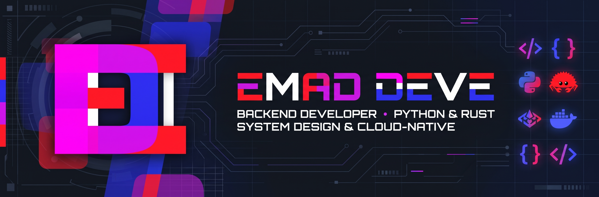

# Hi, I'm Emad 👋

Software engineer who likes understanding how things work from the ground up.

## What I do
I build and maintain a Kubernetes-based cloud / MLOps platform: backend APIs
with **Python (FastAPI, Django)**, deep **Kubernetes** integration, and DevOps
tooling across multiple regions. I care about testing against real clusters
rather than relying only on mocks.

## What I'm exploring
- 🦀 **Rust** – systems programming, FUSE, and building a small language ([kha](https://github.com/EmadDeve20/kha))
- 🤖 **AI agents** – lightweight, transparent agent design where the programmer stays in control
- 🧪 **API testing** – generating tests from OpenAPI specs and recorded HTTP traffic ([swagtrace](https://github.com/EmadDeve20/swagtrace))
- 📚 **Learning** – quantum computing (Qiskit), computational modeling, and category theory
- 🔭 **Curious about** – physics, philosophy of science, and the foundations of computation

## How I like to work
I prefer minimal, transparent, first-principles implementations over heavy
abstractions, and I learn best through runnable code.

## Languages
Persian (native) · English

📫 Feel free to reach out or open an issue on any of my repos.

